Código y Pin-planner

(El código es demasiado extenso por lo que puede ser apreciado en el archivo verilog de la carpeta de este ejrcicio)

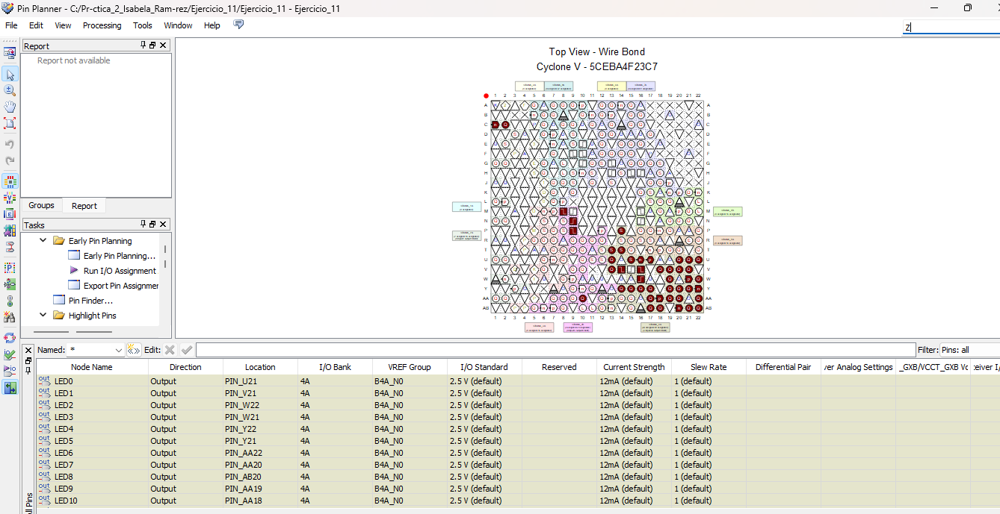

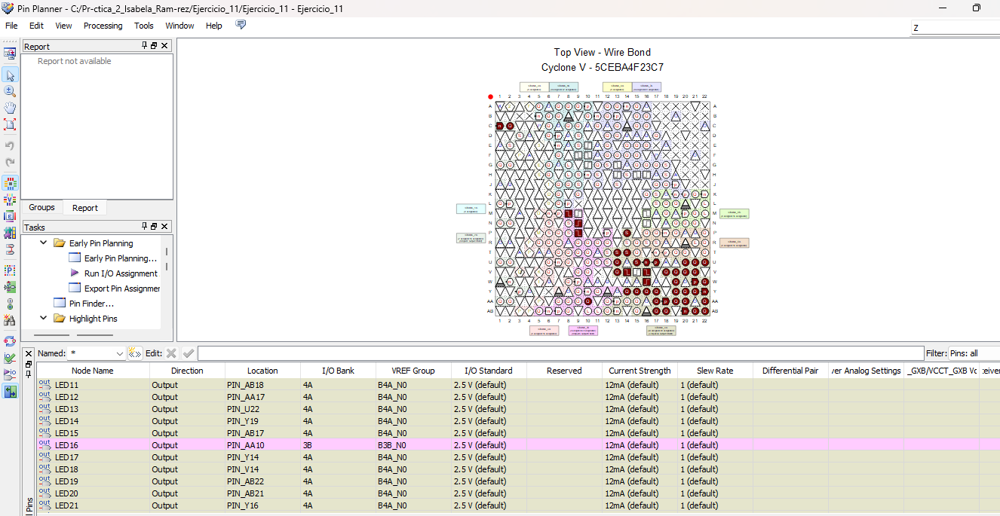

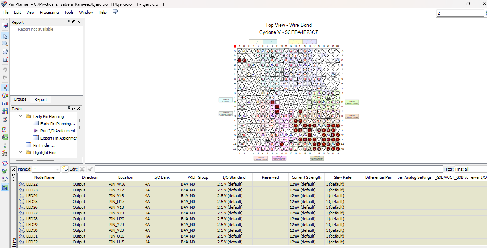

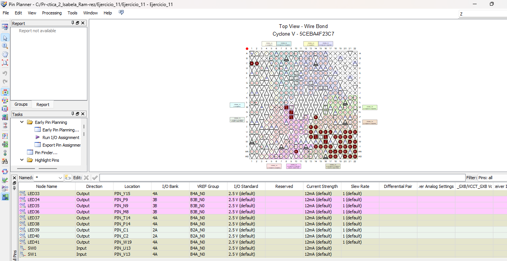

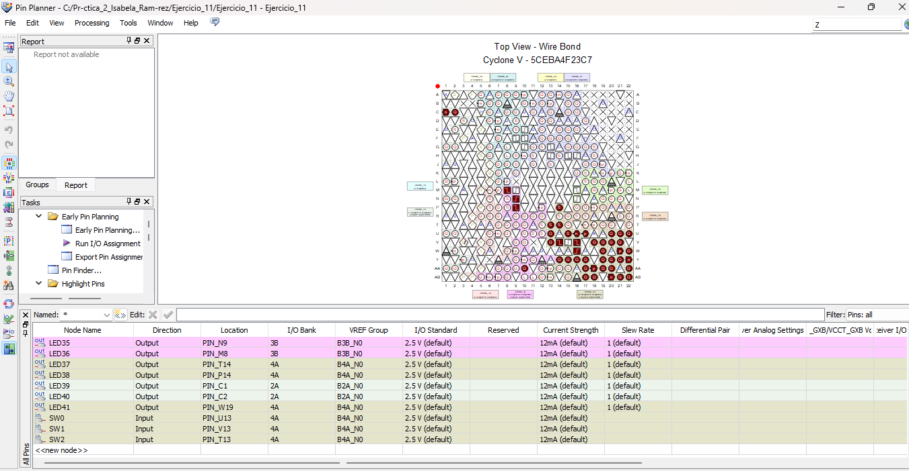

Diagrama de bloque

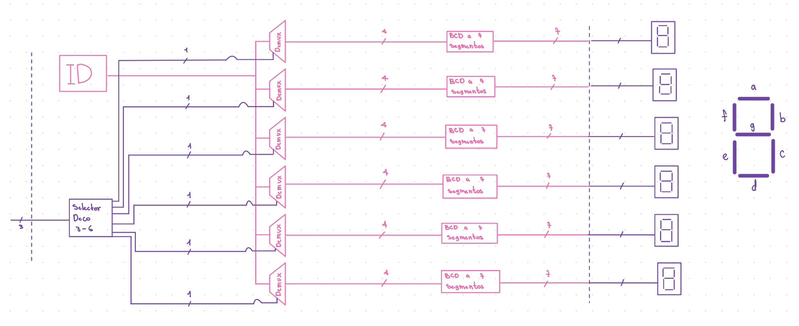

Diagrama RTL

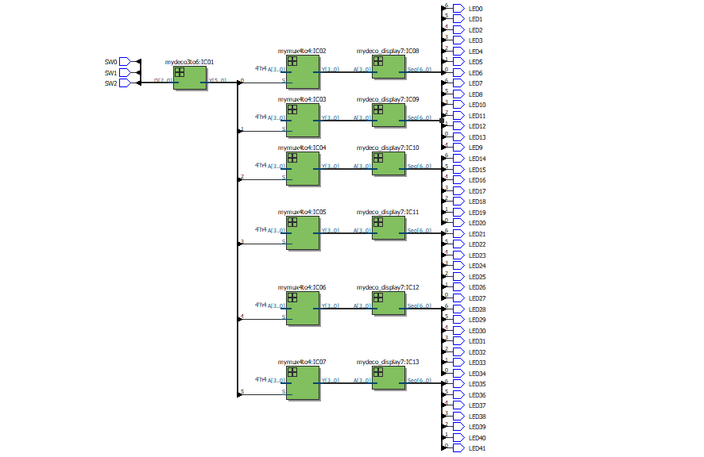

Simulación en ModelSim en el orden:
0,0,0  , 0,0,1  , 0,1,0  , 0,1,1  , 1,0,0  , 1,0,1

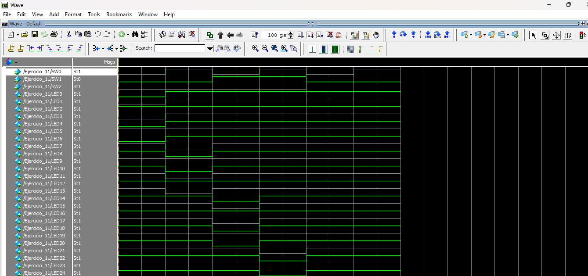

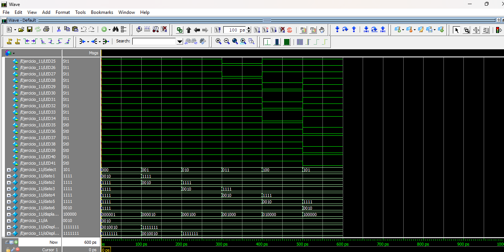

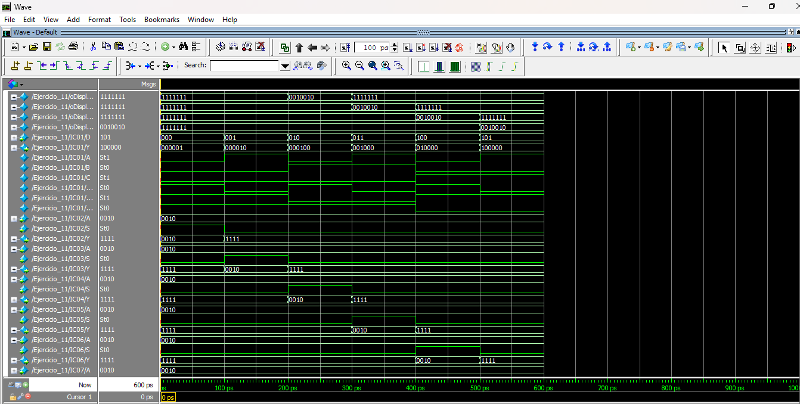

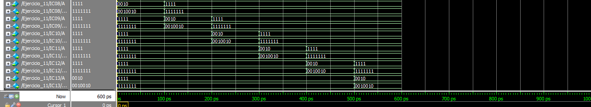

