Código y Pin-planner

(El código es demasiado extenso por lo que puede ser apreciado en el archivo verilog de la carpeta de este ejrcicio)

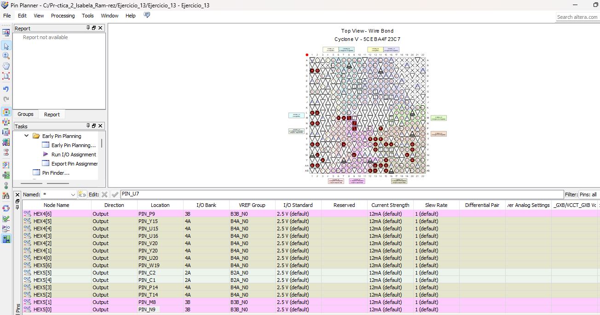

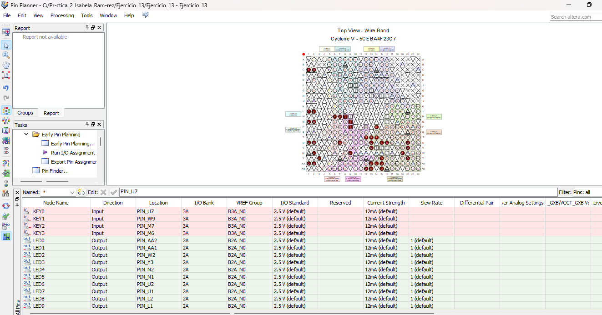

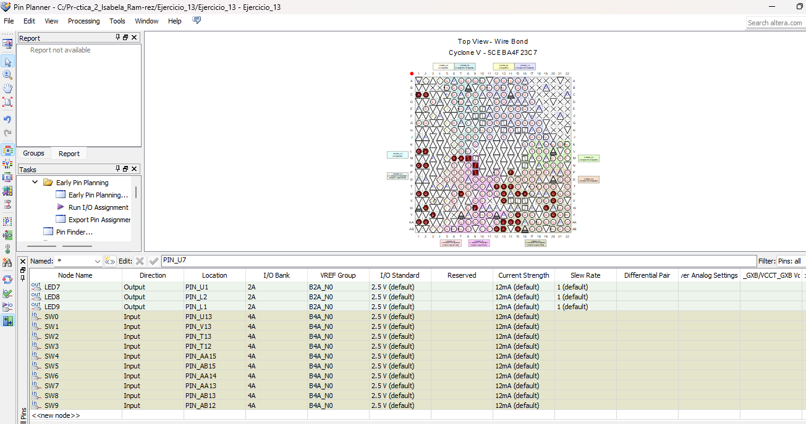

Diagrama de bloque

Simulaciones en ModelSim 

- Operación A+B:

Ejemplo 1 (Columna 1):

A=5 
B=3

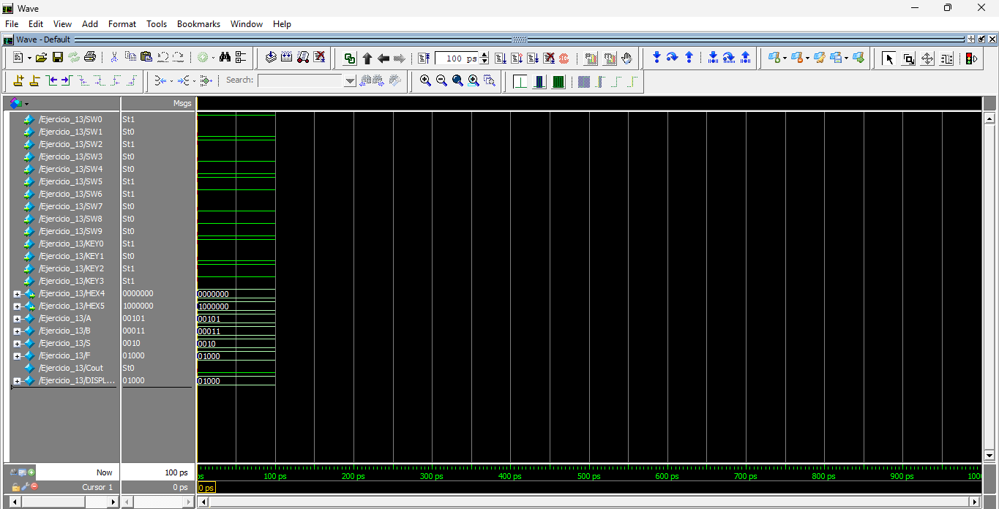

Ejemplo 2 (Columna 2):

A= 31
B= 1

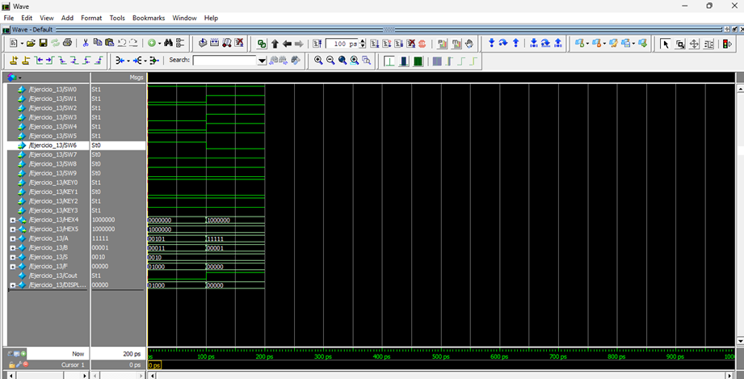

- Operación A-1:

Ejemplo 1 (Columna 3):

A=5

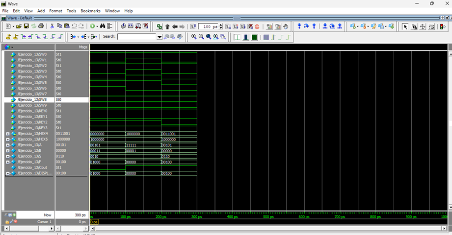

Ejemplo 2 (Columna 4):

A=0

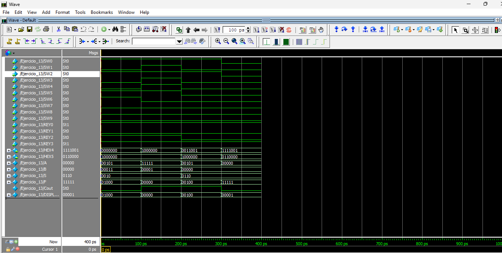

- Operación A-1:

Ejemplo 1 (Columna 5):

A=7

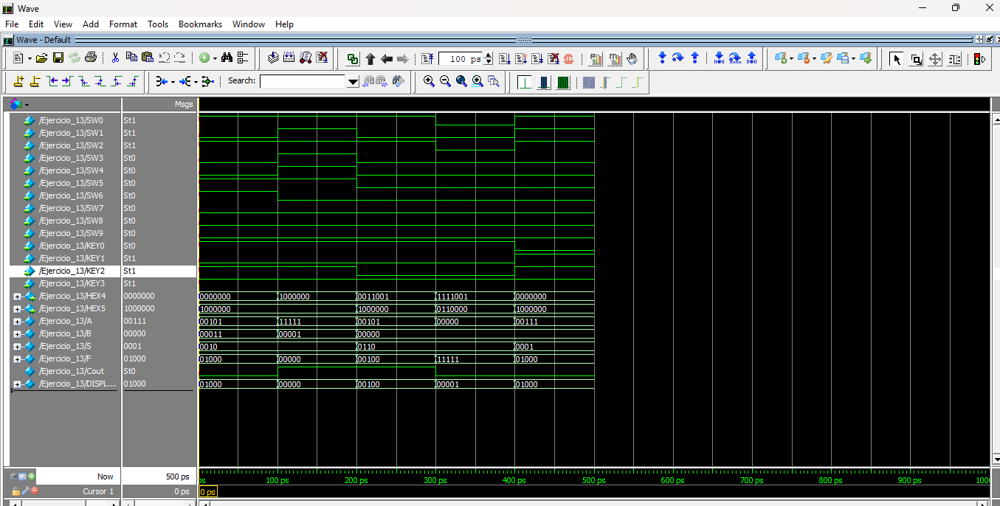

Ejemplo 2 (Columna 6):

A= 31

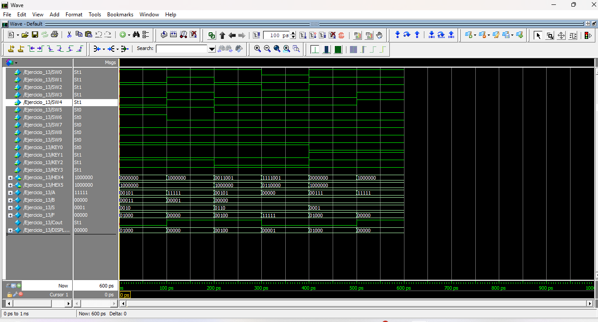

-Operación A AND B

Ejemplo 1 (Columna 7):

A= 22
B= 13

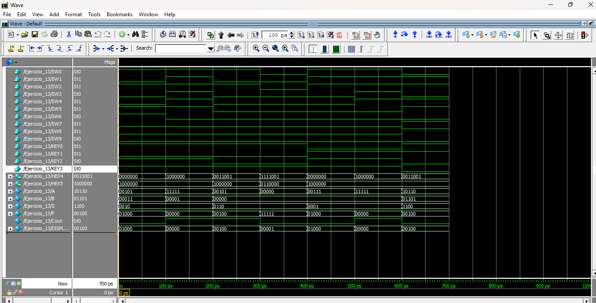

Ejemplo 2 (Columna 8):

A=31
B=7

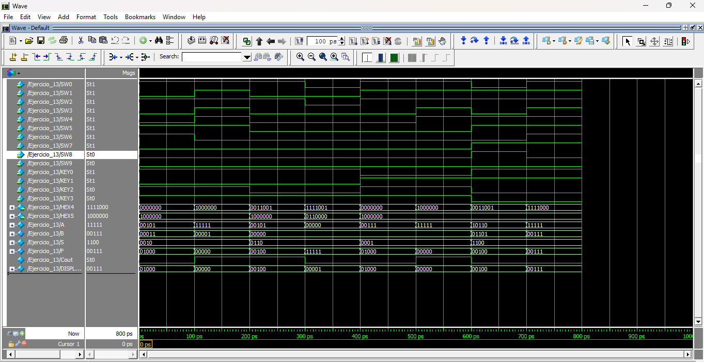

- Operación A < B

Ejemplo 1 (Columna 9):

A= 7
B= 12

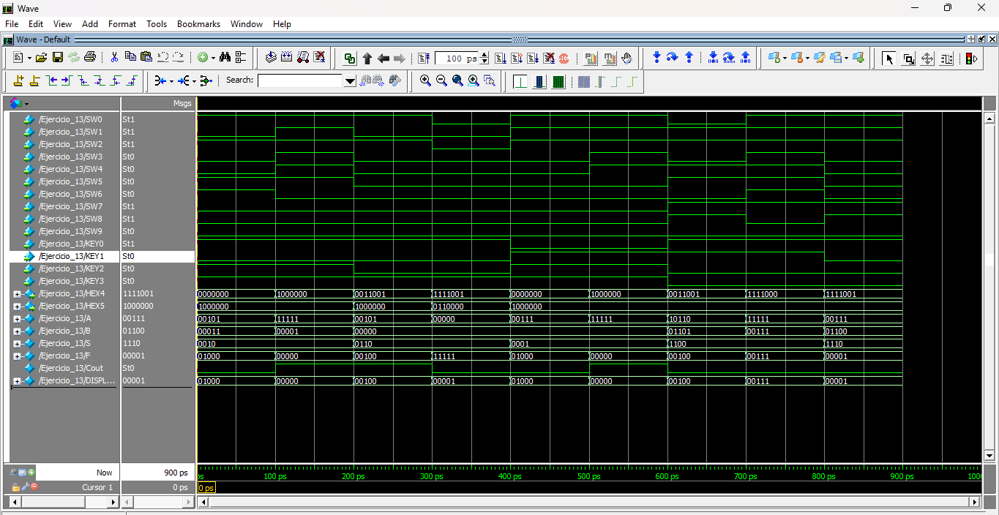

Ejemplo 2 (Columna 10):

A= 12
B= 7

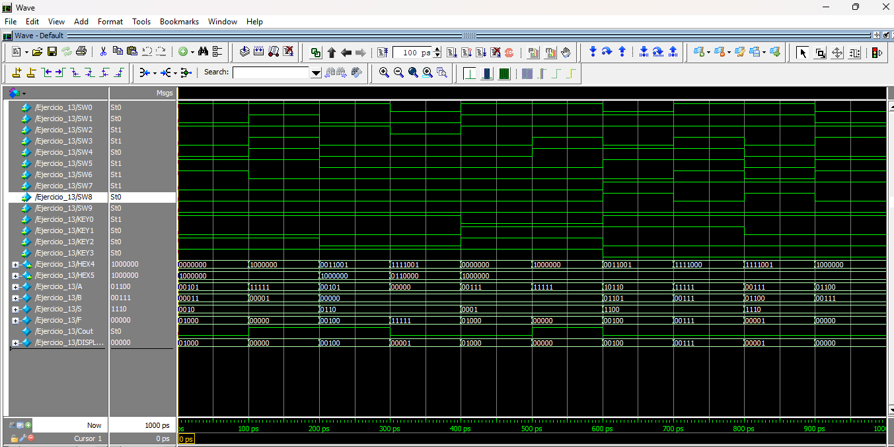

Diagrama RTL

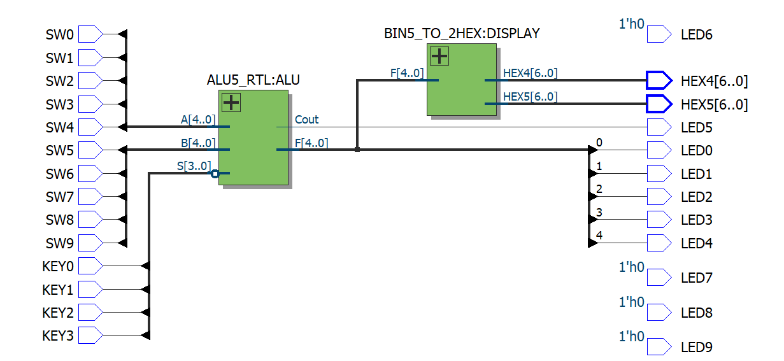
